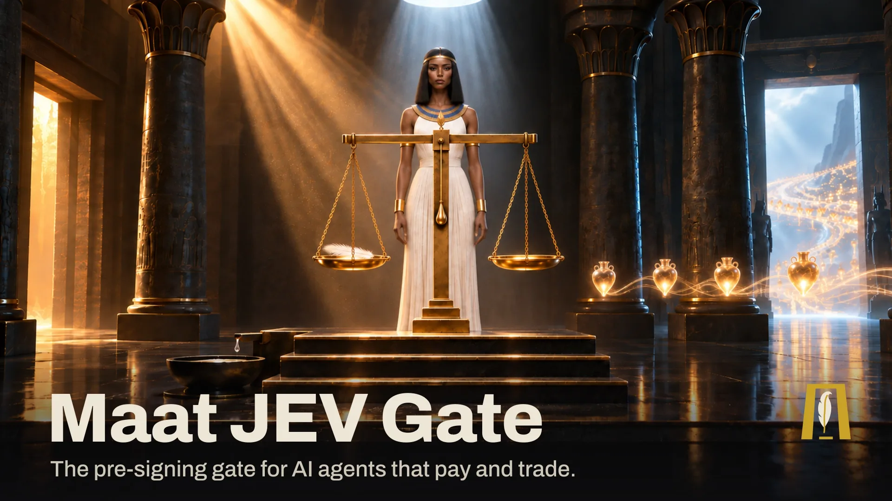
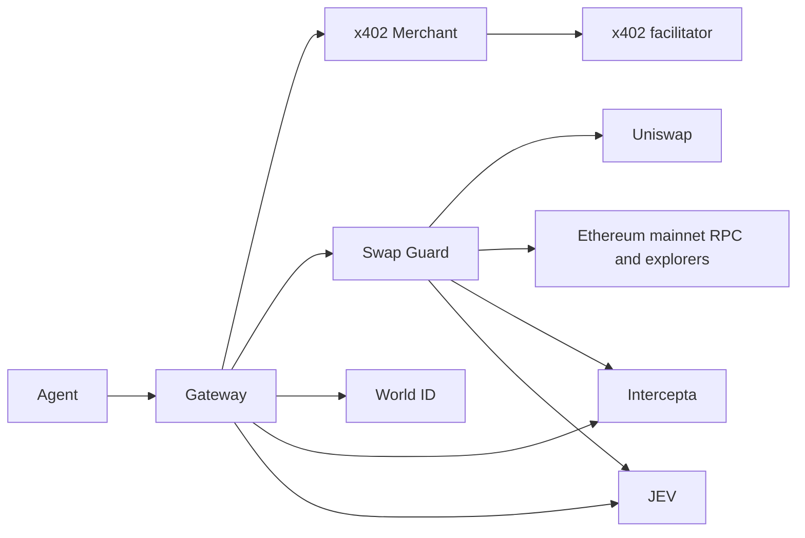
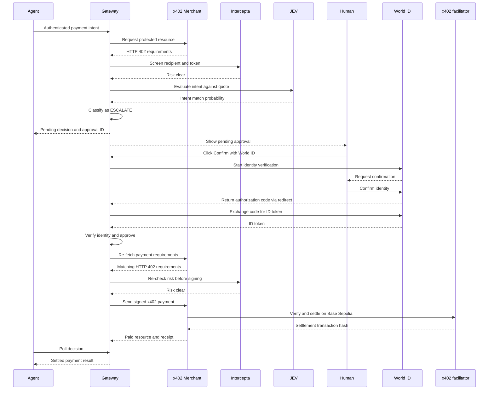
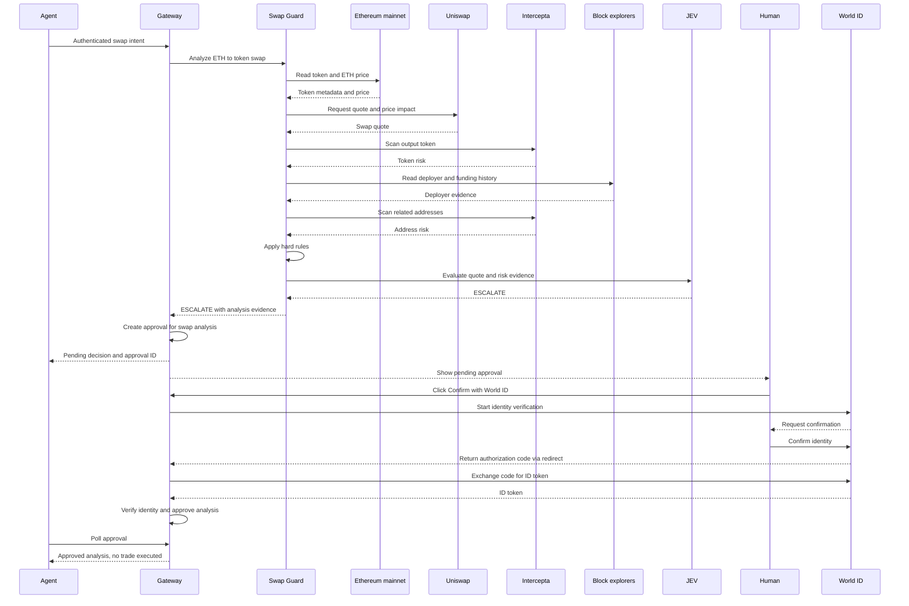
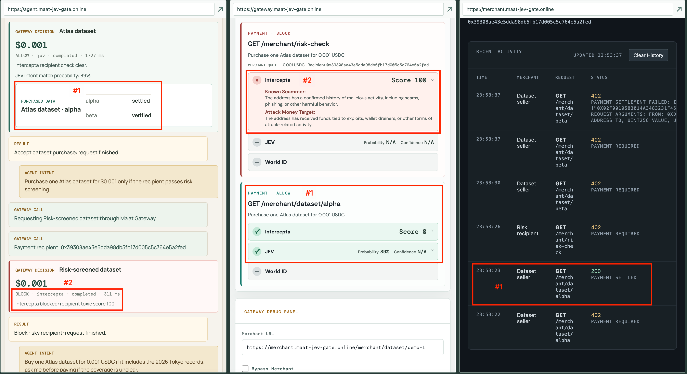
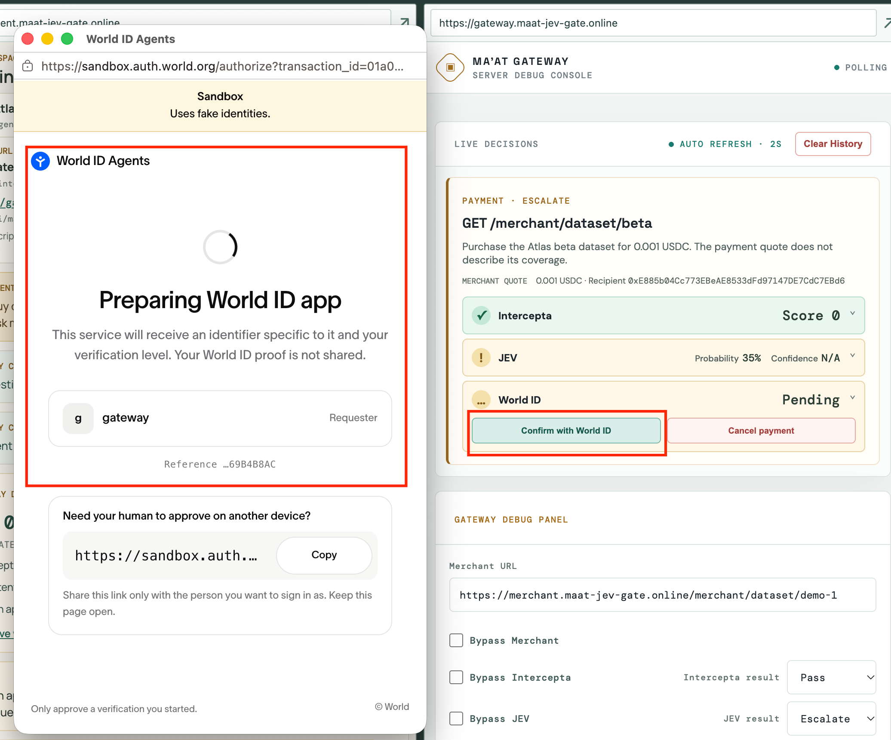
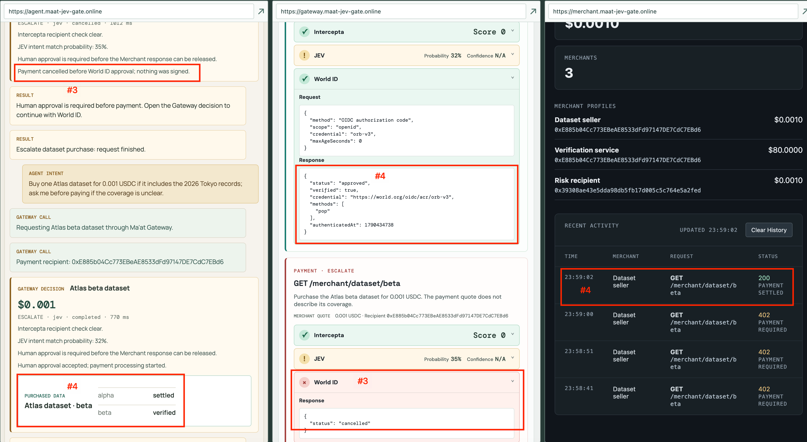
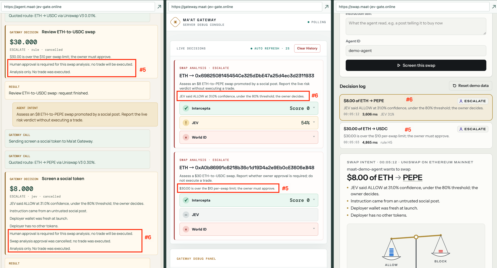

# Maat JEV Gate



Maat is the pre-signing gate for AI agents that pay and trade. The agent holds no keys; every x402 payment and Uniswap swap is screened, weighed, and then signed, blocked, or sent to a World ID–verified human.

Maat Gateway screens an Agent's x402 payments and swap intents before any payment is signed.

The Agent has no treasury key. The Gateway signs approved x402 payments; swap requests are analysis-only and never produce a signed or broadcast trade.

## Projects

| Project | Subproject | URL | Purpose | Integrations |
| --- | --- | --- | --- | --- |
| Maat Gateway | [`gateway/`](gateway/) | [https://gateway.maat-jev-gate.online](https://gateway.maat-jev-gate.online) | Payment decisions, approval, and observer UI | World ID for Agents, Intercepta, JEV |
| Maat Agent | [`agent-demo/`](agent-demo/) | [https://agent.maat-jev-gate.online](https://agent.maat-jev-gate.online) | Agent payment and swap demonstration | Gateway API |
| Maat Merchant | [`x402-demo/merchant/`](x402-demo/merchant/) | [https://merchant.maat-jev-gate.online](https://merchant.maat-jev-gate.online) | x402 resource quotes and payment settlement | x402 |
| Maat Swap Guard | [`swap-guard/`](swap-guard/) | [https://swap.maat-jev-gate.online](https://swap.maat-jev-gate.online) | Ethereum mainnet swap analysis; no trading execution | Uniswap, Intercepta, JEV |
| x402 Client | [`x402-demo/client/`](x402-demo/client/) | — | Local MetaMask payment demo | MetaMask, Merchant API |
| Maat Demo | [`maat-demo/`](maat-demo/) | [https://demo.maat-jev-gate.online](https://demo.maat-jev-gate.online) | Auxiliary three-column observer for the Agent, Gateway, and Merchant; columns can also load Swap Guard | Agent, Gateway, Merchant, Swap Guard pages |

DNS should point these hostnames to the deployment server. Caddy terminates HTTPS and routes each server application to its local Node port.

## Overview

The included Agent is a demo that sends authenticated payment and swap intents to the Gateway over HTTP. Its service owns Gateway credentials and exposes fixed scenarios to its browser UI. A real agent can use the same Gateway API through a skill or MCP server.

For payments, the Gateway calls the Merchant, Intercepta, JEV, and World ID as needed; the Merchant calls the x402 facilitator for settlement. For swaps, the Gateway calls Swap Guard, which gathers quotes and risk evidence from Uniswap, Ethereum data sources, Intercepta, and JEV.

Decisions return one of three verdicts: `ALLOW` accepts the intent, `BLOCK` rejects it, and `ESCALATE` requires human approval through World ID.



## Payment Detail

The Gateway reads the Merchant's 402 quote, screens it with Intercepta, and evaluates the payment intent with JEV. The Agent never receives the treasury key. The Gateway observer shows decisions and lets the user confirm or cancel pending approvals.

The payment account used for Base Sepolia x402 interactions is [`0xcF70836E1E32795B5874E54f903F2466ceBA9cb4`](https://sepolia.basescan.org/address/0xcF70836E1E32795B5874E54f903F2466ceBA9cb4). Its private key is deployed on the Gateway server as the server-only `MAAT_TREASURY_PRIVATE_KEY`.

The Merchant returns payment requirements before it calls the facilitator to verify and settle a signed payment. The Gateway stores payment decisions and approvals in a local JSON history file.

```text
Agent
	`-- Payment intent -> Gateway
		|-- Merchant -> HTTP 402 quote
		|-- Intercepta -> Screen recipient and token
		|-- JEV -> Evaluate intent
		`-- Decision
			|-- ALLOW -> Gateway signs -> Merchant settles
			|-- BLOCK -> Payment stopped
			`-- ESCALATE -> User decision
				|-- Approve -> World ID verification -> Gateway rechecks and signs -> Merchant settles
				`-- Reject -> Payment cancelled; nothing signed
```

The detailed sequence below shows an `ESCALATE` payment approved by the user:



## Swap Detail

The Gateway forwards swap intents to Swap Guard for a Uniswap quote and risk analysis. No trade is signed or broadcast.

Swap Guard uses the Uniswap Trading API when configured and otherwise quotes v2/v3 contracts through mainnet RPC. It checks token and deployer risk, traces funding with explorer data, applies hard rules, and asks JEV when the rules leave a decision open.

```text
Agent
	`-- Swap intent -> Gateway -> Swap Guard
		|-- Ethereum mainnet -> Token data and ETH price
		|-- Uniswap -> Quote and price impact
		|-- Intercepta and explorers -> Token, address, and deployer risk
		|-- Hard rules, then JEV if needed
		`-- Decision -> Gateway
			|-- ALLOW / BLOCK -> Return analysis to Agent
			`-- ESCALATE -> User decision
				|-- Approve -> World ID verification -> Release approved analysis
				`-- Reject -> Cancel analysis approval
```

The detailed sequence below shows an `ESCALATE` swap analysis approved by the user:



## Sponsor integration code

| Integration | Call and decision locations |
| --- | --- |
| World ID for Agents | [Start OIDC authorization](gateway/server/world.ts#L27), [exchange the code](gateway/server/world.ts#L48), [verify the ID token](gateway/server/world.ts#L67), and [handle approval and payment release](gateway/server/app.ts#L643) |
| Uniswap | [Request a Trading API quote](swap-guard/lib/uniswap.ts#L175) or [quote v2/v3 contracts onchain](swap-guard/lib/uniswap.ts#L73); the [Swap Guard decision pipeline](swap-guard/lib/engine.ts#L54) uses the quote for analysis only |
| Intercepta | [Call the live API](gateway/server/intercepta.ts#L92), [screen the x402 recipient and token](gateway/server/intercepta.ts#L120), and [apply the result before payment signing](gateway/server/app.ts#L798); Swap Guard also [scans tokens](swap-guard/lib/intercepta.ts#L108) |

## Integration feedback

### World ID for Agents

[Integration feedback](FEEDBACK.md#world-id-for-agents)

### Intercepta

[Integration feedback](FEEDBACK.md#intercepta)

### Uniswap

[Integration feedback](FEEDBACK.md#uniswap)

## Screenshots

### Intercepta payment screening



### World ID confirmation



### World ID approval result



### Uniswap swap analysis



## Deploy Gateway

The Gateway deploys with PM2 and Caddy. Fill the deployment and production integration values in the ignored `gateway/.env`, then run:

```bash
cd gateway
npm install
npm run deploy
```

The script builds and type-checks the Gateway locally, syncs the build, server files, `.env`, and `deploy/caddy/site.caddy` to `/opt/maat-gateway` and the Caddy site directory, installs production dependencies, reloads the `maat-gateway` PM2 process, and verifies `/health` on the remote host.
